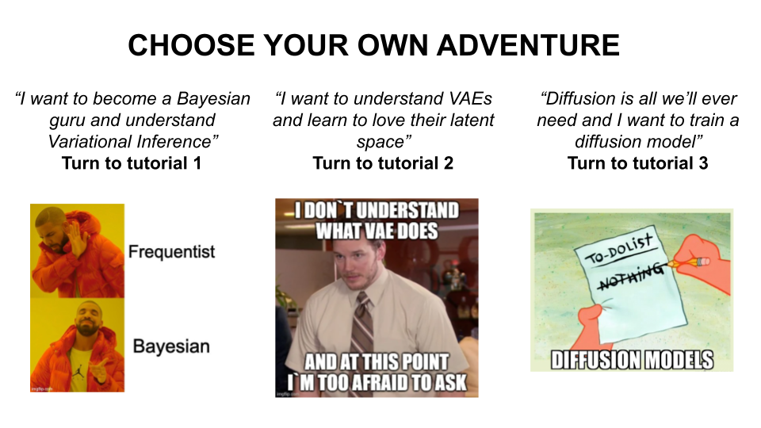

# Tutorial for Generative modeling, with connection to and applications in physics 2023 IAIFI Summer School

This repo contains a set of three tutorials design to accompany @smsharma 's lecture on generative modeling for the [2023 IAIFI summer school](https://iaifi.org/phd-summer-school.html)

